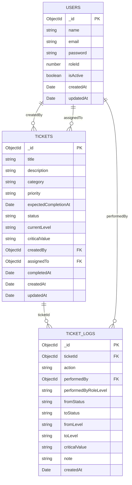

# Helpdesk Ticket Maintenance System

A web-based helpdesk ticket system supporting L1–L3 escalation workflow, role-based access control, and activity logging.

## Tech Stack

| Layer    | Technology                                  |
| -------- | ------------------------------------------- |
| Frontend | React 19 (Vite) + TypeScript + Tailwind CSS |
| Backend  | Express.js 5 + TypeScript                   |
| Database | MongoDB 7 (replica set)                     |
| Auth     | JWT (role-based access control)             |
| Testing  | Jest + Testing Library                      |

## Prerequisites

- **Node.js** ≥ 18
- **Docker & Docker Compose** (for MongoDB)

## Getting Started

### 1. Start MongoDB
```bash
docker compose up -d
```

This starts a MongoDB 7 replica set on port `27017`.

### 2. Backend
```bash
cd backend
cp .env.example .env   # edit values as needed
npm install
npm run dev
```

The API runs at `http://localhost:3000`.

### 3. Frontend
```bash
cd frontend
cp .env.example .env   # edit values as needed
npm install
npm run dev
```

The app runs at `http://localhost:5173`.

---

## Environment Variables

### Backend (`backend/.env`)

| Variable         | Description                      | Default                     |
| ---------------- | -------------------------------- | --------------------------- |
| `PORT`           | Server port                      | `3000`                      |
| `MONGODB_URI`    | MongoDB connection string        | see `.env.example`          |
| `JWT_SECRET`     | JWT signing key (min 32 chars) ) | —                           |
| `JWT_EXPIRES_IN` | Token expiration                 | `24h`                       |
| `NODE_ENV`       | Environment                      | `development`               |
| `WEB_URL`        | Frontend URL (CORS)              | `http://localhost:5173`     |

### Frontend (`frontend/.env`)

| Variable                   | Description                               | Default                        |
| -------------------------- | ----------------------------------------- | ------------------------------ |
| `VITE_API_URL`             | Backend API URL                           | `http://localhost:3000/api`    |
| `VITE_MIN_LOADING_TIMEOUT` | Minimum skeleton loading duration (ms)    | `500`                          |

---

## Sample Credentials

Create accounts via the **Sign Up** page and select a role during registration.

| Email             | Password  | Role               | Level |
| ----------------- | --------- | ------------------ | ----- |
| `l1@helpdesk.com` | `pass123` | Helpdesk Agent     | L1    |
| `l2@helpdesk.com` | `pass123` | Technical Support  | L2    |
| `l3@helpdesk.com` | `pass123` | Advanced Support   | L3    |

---

## User Roles & Permissions

| Action                  | L1 | L2 | L3 |
| ----------------------- | -- | -- | -- |
| Create ticket           | ✅ | ❌ | ❌ |
| Update status           | ✅ | ✅ | ✅ |
| Escalate to L2          | ✅ | ❌ | ❌ |
| Assign critical value   | ❌ | ✅ | ❌ |
| Escalate to L3          | ❌ | ✅ | ❌ |
| View all tickets        | ✅ | ✅ | ✅ |

---

## Ticket Escalation Flow
```
L1: Create Ticket → Set Attending → Escalate to L2 if unresolved
L2: Set Attending → Assign Critical Value (C1–C3) → Escalate to L3 if unresolved
L3: Set Attending → Mark as Completed
```

**Status transitions:**
```
New → Attending → Completed
```

Status resets to `New` on each escalation so the next level starts fresh.

**Critical values (L2 only):**
- `C1` — System down
- `C2` — Partial feature issue
- `C3` — Minor problem or inquiry

---

## Running Tests

### Backend
```bash
cd backend
npm test
```

### Frontend
```bash
cd frontend
npm test
```

---

## Database Schema


---

## Project Structure
```
├── docker-compose.yaml
├── backend/
│   └── src/
│       ├── modules/        # auth, tickets, ticketLogs, users, userRoles
│       ├── server/         # Express routes, middleware
│       ├── config/         # env, db
│       └── shared/         # utils, types
└── frontend/
    └── src/
        ├── pages/          # auth, tickets (list, detail, create, update L1/L2/L3)
        ├── components/     # ui (skeleton, error), layout (protected route)
        ├── services/       # API clients (auth, ticket, user)
        ├── store/          # Zustand auth store
        ├── constants/      # statuses, categories, priorities
        ├── types/          # TypeScript interfaces
        ├── utils/          # ticket style maps, date helpers
        └── router/         # React Router config
```